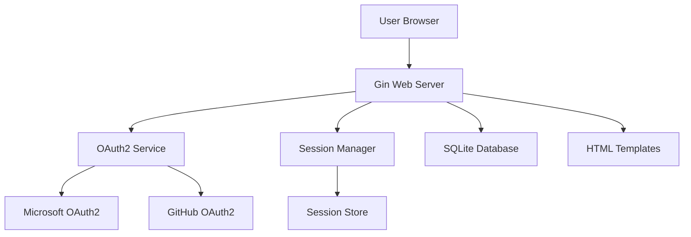
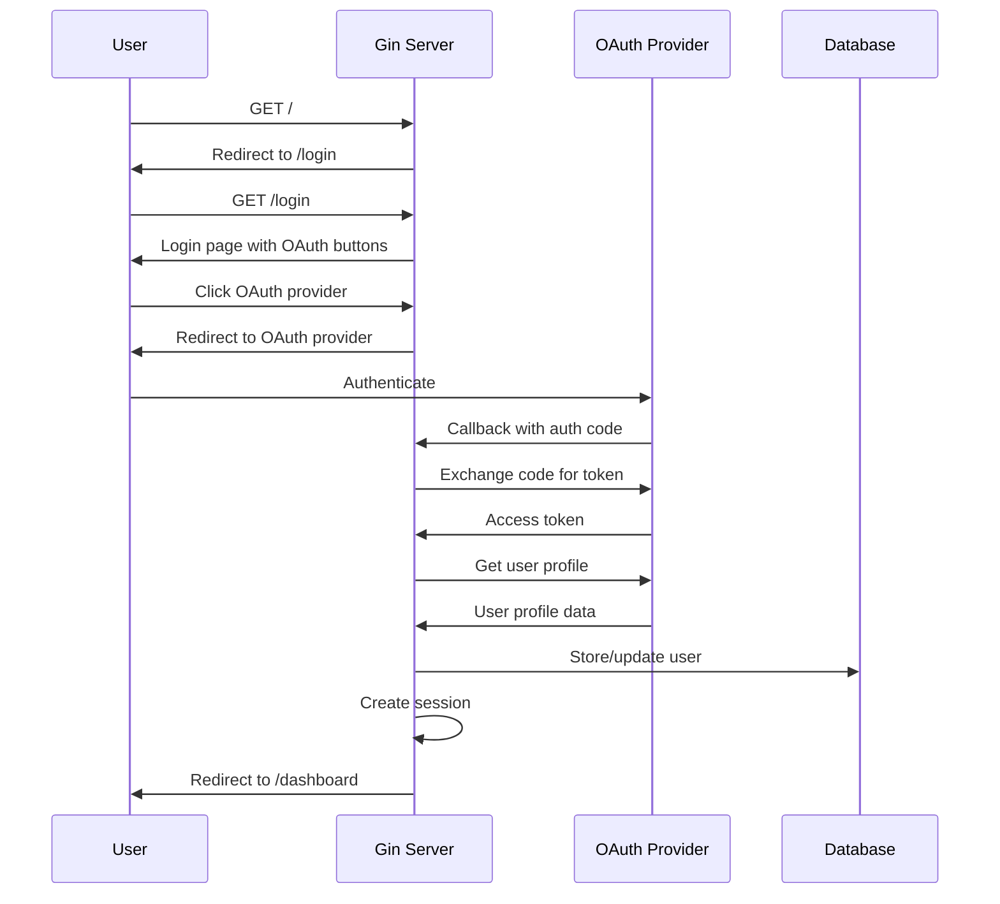

# Design Document

## Overview

The SSO Web Application is a lightweight Go web service built with the Gin framework that provides secure authentication through Microsoft 365 and GitHub OAuth2 providers. The application follows a traditional server-side rendered architecture with session-based authentication, using SQLite for data persistence and Go's html/template package for dynamic HTML generation.

## Architecture

### High-Level Architecture



### Request Flow



## Components and Interfaces

### 1. Web Server (Gin Framework)

**Responsibilities:**
- HTTP request routing and handling
- Middleware for authentication, logging, and error handling
- Static file serving
- Template rendering

**Key Routes:**
- `GET /` - Root redirect to login or dashboard
- `GET /login` - Login page with OAuth options
- `GET /auth/:provider` - Initiate OAuth flow
- `GET /auth/callback/:provider` - OAuth callback handler
- `GET /dashboard` - Protected user dashboard
- `POST /logout` - Session termination

### 2. Authentication Service

**Interface:**
```go
type AuthService interface {
    InitiateOAuth(provider string) (redirectURL string, state string, error)
    HandleCallback(provider, code, state string) (*UserProfile, error)
    ValidateSession(sessionID string) (*User, error)
    CreateSession(userID string) (sessionID string, error)
    DestroySession(sessionID string) error
}
```

**OAuth2 Providers:**
- Microsoft 365 (Azure AD)
- GitHub

### 3. User Management

**User Model:**
```go
type User struct {
    ID          int       `db:"id"`
    Provider    string    `db:"provider"`
    ProviderID  string    `db:"provider_id"`
    Username    string    `db:"username"`
    Email       string    `db:"email"`
    AvatarURL   string    `db:"avatar_url"`
    CreatedAt   time.Time `db:"created_at"`
    UpdatedAt   time.Time `db:"updated_at"`
}
```

**Repository Interface:**
```go
type UserRepository interface {
    FindByProviderID(provider, providerID string) (*User, error)
    Create(user *User) error
    Update(user *User) error
}
```

### 4. Session Management

**Session Model:**
```go
type Session struct {
    ID        string    `db:"id"`
    UserID    int       `db:"user_id"`
    ExpiresAt time.Time `db:"expires_at"`
    CreatedAt time.Time `db:"created_at"`
}
```

**Session Store Interface:**
```go
type SessionStore interface {
    Create(userID int, duration time.Duration) (*Session, error)
    Get(sessionID string) (*Session, error)
    Delete(sessionID string) error
    Cleanup() error // Remove expired sessions
}
```

### 5. Database Layer

**Database Schema:**
```sql
CREATE TABLE users (
    id INTEGER PRIMARY KEY AUTOINCREMENT,
    provider TEXT NOT NULL,
    provider_id TEXT NOT NULL,
    username TEXT NOT NULL,
    email TEXT,
    avatar_url TEXT,
    created_at DATETIME DEFAULT CURRENT_TIMESTAMP,
    updated_at DATETIME DEFAULT CURRENT_TIMESTAMP,
    UNIQUE(provider, provider_id)
);

CREATE TABLE sessions (
    id TEXT PRIMARY KEY,
    user_id INTEGER NOT NULL,
    expires_at DATETIME NOT NULL,
    created_at DATETIME DEFAULT CURRENT_TIMESTAMP,
    FOREIGN KEY (user_id) REFERENCES users (id)
);

CREATE INDEX idx_sessions_expires_at ON sessions(expires_at);
```

### 6. Template System

**Template Structure:**
- `templates/base.html` - Base layout template
- `templates/login.html` - Login page template
- `templates/dashboard.html` - User dashboard template
- `templates/error.html` - Error page template

**Template Data Models:**
```go
type LoginPageData struct {
    Title string
    Error string
}

type DashboardPageData struct {
    Title    string
    Username string
    Email    string
    Avatar   string
}
```

## Data Models

### OAuth2 Configuration

```go
type OAuth2Config struct {
    ClientID     string
    ClientSecret string
    RedirectURL  string
    Scopes       []string
    AuthURL      string
    TokenURL     string
    UserInfoURL  string
}
```

### Application Configuration

```go
type Config struct {
    Port           string
    DatabaseURL    string
    SessionSecret  string
    BaseURL        string
    Microsoft      OAuth2Config
    GitHub         OAuth2Config
}
```

## Error Handling

### Error Types

1. **Authentication Errors**
   - Invalid OAuth state
   - OAuth provider errors
   - Token exchange failures
   - User profile retrieval failures

2. **Session Errors**
   - Invalid session ID
   - Expired sessions
   - Session creation failures

3. **Database Errors**
   - Connection failures
   - Query execution errors
   - Constraint violations

### Error Response Strategy

- **User-facing errors**: Redirect to login with error message
- **API errors**: JSON response with error details
- **System errors**: Log error and return generic 500 response
- **Validation errors**: Return 400 with specific field errors

### Middleware Stack

```go
// Middleware order (top to bottom)
1. Recovery middleware (panic recovery)
2. Logger middleware (request logging)
3. CORS middleware (if needed)
4. Session middleware (session loading)
5. Authentication middleware (for protected routes)
```

## Testing Strategy

### Unit Tests

1. **Authentication Service Tests**
   - OAuth flow initiation
   - Callback handling
   - Token validation
   - User profile parsing

2. **Repository Tests**
   - User CRUD operations
   - Session management
   - Database constraints

3. **Handler Tests**
   - Route responses
   - Template rendering
   - Error handling
   - Redirects

### Integration Tests

1. **OAuth Flow Tests**
   - End-to-end authentication flow
   - Provider-specific implementations
   - Error scenarios

2. **Session Tests**
   - Session creation and validation
   - Session expiration
   - Concurrent session handling

3. **Database Tests**
   - Schema migrations
   - Data persistence
   - Transaction handling

### Test Database

- Use in-memory SQLite for unit tests
- Separate test database for integration tests
- Database fixtures for consistent test data

## Security Considerations

### OAuth2 Security

- **State Parameter**: Prevent CSRF attacks during OAuth flow
- **PKCE**: Consider implementing for additional security
- **Redirect URI Validation**: Strict validation of callback URLs

### Session Security

- **HTTP-Only Cookies**: Prevent XSS attacks
- **Secure Cookies**: HTTPS-only in production
- **SameSite Attribute**: CSRF protection
- **Session Expiration**: Automatic cleanup of expired sessions

### General Security

- **Input Validation**: Sanitize all user inputs
- **SQL Injection Prevention**: Use parameterized queries
- **XSS Prevention**: Template auto-escaping
- **Rate Limiting**: Prevent brute force attacks

## Performance Considerations

### Template Caching

- Parse templates at startup
- Cache compiled templates in memory
- Template hot-reloading in development

### Database Optimization

- Connection pooling
- Prepared statements
- Index optimization for session lookups
- Periodic cleanup of expired sessions

### Session Management

- In-memory session cache for frequently accessed sessions
- Background cleanup of expired sessions
- Session ID generation using crypto/rand

## Deployment Architecture

### Environment Configuration

- Environment variables for sensitive configuration
- Configuration validation at startup
- Default values for optional settings

### Database Setup

- Automatic schema migration on startup
- SQLite file permissions and location
- Backup and recovery procedures

### Monitoring and Logging

- Structured logging with levels
- Request/response logging
- Error tracking and alerting
- Health check endpoints